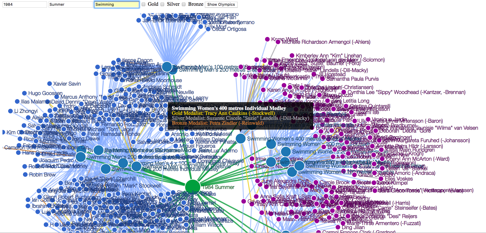

# 120 Years of Olympics History Force Directed Graph

**Overview**
--------------------------------------------------------------------------
Represent 120 years Olympic History as Graph.  Participation and results from every Olympic event 
 over 120 years is represented in graph form. Nodes include games, events and athletes. Relationships are 
 athlete participation in events and color code by gold, silver, bronze or blue for participation.
 

  

 ***Primary Technologies***
 * [Spring Boot 2](https://spring.io/projects/spring-boot) Web application for REST endpoints and data load
 * [Neo4j Database](https://neo4j.com/) to persist data in graph form
 * [Spring Data Neo4j](https://spring.io/projects/spring-data-neo4j) for object graph model
 * [Apache Groovy language](http://groovy-lang.org/) for expressiveness and Spring/Java integration
 * [D3.js](https://d3js.org/) and Javascript to visualize graph of Olympic games, events and athletes

 ***Support Technologies***
 * [Gradle](https://gradle.org/) to build application
 * [Spock Framework](http://spockframework.org/) for automated testing
 * [GroovyCSV](https://github.com/xlson/groovycsv) as library to parse CSV data
 * [Java Platform, Standard Edition 8](https://www.oracle.com/technetwork/java/javase/overview/index.html) to run Spring Boot and Groovy
 
 _all technologies are open source_

**Get Project**
--------------------------------------------------------------------------
You will need Neo4j installed on your Linux or Mac machine,

    $git clone https://github.com/cleuer/olympics.git

Edit `src/main/resources.application.properties` to reflect your Neo4J password

    spring.data.neo4j.username=neo4j
    spring.data.neo4j.password=admin

**Start Neo4j**
--------------------------------------------------------------------------
First start Neo4j database in a terminal

    $neo4j console

**Start Application**
--------------------------------------------------------------------------
Run Spring Boot application

    $./gradlew clean bootRun

View visualization in browser

     http://localhost:8090

**Load Data**
---------------------------------------------------------------------------
Data files are located in `src/main/resources` in csv format. The file `olympic_history_120_years.csv` is the complete dataset
To load data when the application starts modify setting in `src/main/resources.application.properties` 
Below is the default which will load two Olympic events from 1984 at startup:
 
    olympics.load-data=true
    olympics.data-file-name=olympic_history_1984_summer_swimming_sample.csv

**Setting**
---------------------------------------------------------------------------
By default an athlete will only display once in a graph. To enable the same athlete
to display once for each event (see image above) change the setting to true:

     olympics.graph-detach-athletes=true
     
**Run Tests**
--------------------------------------------------------------------------
Execute automated tests

    $./gradlew clean check

**Data Source**
--------------------------------------------------------------------------
Historical dataset of 120 years Olympic history is available on kaggle.com

[120 years of Olympic history: athletes and results](https://www.kaggle.com/heesoo37/120-years-of-olympic-history-athletes-and-results)

_Special thanks to Randi H Griffin and contributors to www.sports-reference.com for creating and curating this dataset_

  ***Author: Christopher Leuer***